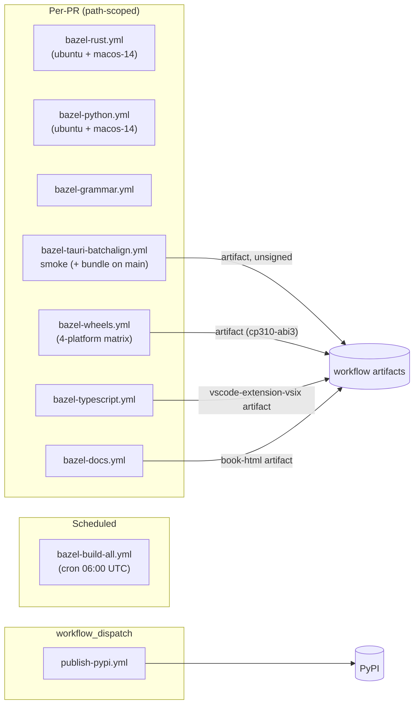

# CI and Release

**Status:** Current
**Last modified:** 2026-06-01 01:05 PDT

This is the top-level map of the CI and release surface. For per-product
detail, see [Release Pipeline](../operations/release-pipeline.md);
for code-signing posture, see
[Code Signing and Distribution](../operations/code-signing-and-distribution.md).

## Pre-merge verification

Every change must pass `bazel build //... && bazel test //...` before
merging:

```bash
bazel build //... && bazel test //...
```

See [Quality Gates](./quality-gates.md) and
[Testing](./testing.md) for the full local gate definitions and the
mapping into CI jobs.

The pre-push hook (`scripts/pre-push.sh`, installed via
`ln -sf ../../scripts/pre-push.sh .git/hooks/pre-push`) runs the fast
subset on `git push`.

## Workflow map



Verified against `.github/workflows/` on 2026-06-01.

## Workflows in detail

| Workflow file | Workflow name | Triggers | Jobs |
|---|---|---|---|
| `bazel-rust.yml` | `bazel · rust` | push/PR on Rust paths | `build-and-test` (ubuntu + macos-14) |
| `bazel-python.yml` | `bazel · python` | push/PR on Python / engine paths | `build-and-test` (ubuntu + macos-14) |
| `bazel-grammar.yml` | `bazel · grammar` | push/PR on grammar / symbol paths | `rust-binding`, `generated-artifacts-fresh` |
| `bazel-typescript.yml` | `bazel · typescript` | push/PR on `apps/vscode-extension/**`, `schemas/**` | `vscode-extension` |
| `bazel-docs.yml` | `bazel · docs` | push/PR on `book/**`, `bazel/book/**` | `build-and-linkcheck` |
| `bazel-tauri-batchalign.yml` | `bazel · tauri-batchalign` | push/PR/dispatch on Batchalign GUI paths | `smoke` (every PR), `bundle` (main + dispatch only; macOS arm64, macOS x86_64, Linux x86_64) |
| `bazel-wheels.yml` | `bazel · wheels (PR matrix)` | push/PR on wheel-affecting paths | `build` (macos-14, macos-13, ubuntu, ubuntu-arm) |
| `bazel-build-all.yml` | `bazel · build-all (nightly)` | cron `0 6 * * *`, dispatch | `build-all` (ubuntu + macos-14, full `//...`) |
| `publish-pypi.yml` | `publish · pypi (batchalign)` | `workflow_dispatch` only | `verify-version`, `build` (5-platform matrix), `publish` (gated on `publish=true` input) |

Windows is not exercised in any workflow today. The `bundle` matrix
and the `bazel-wheels.yml` matrix both have Windows rows commented out
(`tools/bazel` bash wrapper / `multitool` `uv.exe` layout, respectively).

## Generated artifact freshness

The grammar's generated artifacts (`grammar/src/parser.c`,
`grammar/src/grammar.json`, `grammar/src/node-types.json`) are
checked by `bazel-grammar.yml`'s `generated-artifacts-fresh` job. If
they drift, regenerate locally:

```bash
cd grammar && tree-sitter generate
git diff grammar/src/parser.c grammar/src/grammar.json grammar/src/node-types.json
git add grammar/src/ && git commit -m "grammar: regenerate"
```

Spec-driven artifacts (tree-sitter corpus tests, generated Rust parser
tests, error docs) are regenerated by:

```bash
just spec gen-tree-sitter-tests && just spec gen-rust-tests && just spec gen-error-docs
git diff --exit-code
```

Spec drift is not enforced by a dedicated CI job today; it's caught by
the per-package test jobs failing when generated tests don't match
generated source.

## Release process, per surface

Only one surface has a fully automated release workflow today
(`batchalign3` → PyPI). The rest are either workflow-artifact-only or
hand-published. Full per-surface narrative lives in
[Release Pipeline](../operations/release-pipeline.md). Summary:

| Surface | Build in CI | Release path today | Gap |
|---|---|---|---|
| `batchalign3` PyPI wheel | `bazel-python.yml` + `bazel-wheels.yml` | `publish-pypi.yml` (`workflow_dispatch`, OIDC trusted publisher) | none for PyPI |
| `chatter` / `chatter-lsp` | `bazel-rust.yml`, nightly `bazel-build-all.yml` | None — install from source | No release workflow |
| VS Code extension `.vsix` | `bazel-typescript.yml` (artifact only) | Manual `vsce publish` from operator workstation | No automated marketplace workflow |
| Batchalign desktop bundle | `bazel-tauri-batchalign.yml` `bundle` job (main + dispatch) | Workflow artifacts only; unsigned; macOS + Linux | No GitHub Release upload; no Windows; no signing |
| Chatter desktop GUI | Nightly `bazel-build-all.yml` only | None | No CI bundle target; no release |
| mdBook | `bazel-docs.yml` (artifact only) | None | No GitHub Pages deploy |

### Promoting a surface

When automating a release for any surface above:

1. Run the relevant per-PR workflow on a clean `main` and confirm
   green.
2. Update the canonical version source for that surface (`just
   versions` to inspect — current values: batchalign wheel `0.3.0`,
   Rust workspace `0.2.0`, batchalign-engine `0.3.0`, Chatter GUI
   bundle `0.1.0`).
3. Add the publish workflow alongside (e.g. a `publish-chatter.yml`
   modelled on `publish-pypi.yml`).
4. Update [Release Pipeline](../operations/release-pipeline.md),
   [Release Contract](../operations/release-contract.md), and
   [Code Signing and Distribution](../operations/code-signing-and-distribution.md)
   in the same patch.

## First-release release-ops guardrails

- **VS Code stays manual-publish until a release workflow exists.**
  Do not add marketplace-claiming language to install docs until
  automation lands.
- **Desktop bundles are unsigned.** Any download instructions must
  mark them as "unsigned development build". See
  [Code Signing and Distribution](../operations/code-signing-and-distribution.md).
- **`publish-pypi.yml` is the only publish workflow.** Treat any
  reference to `release.yml`, `vscode-release.yml`,
  `batchalign-release.yml`, `batchalign-desktop.yml`,
  `publish-chatter.yml`, `publish-vscode.yml`, or `publish-desktop.yml`
  in older docs as obsolete — those workflows do not exist.

## Cross-repo testing

After changes to core crates, verify the downstream consumer locally:

```bash
# batchalign (Python + Rust)
cd /path/to/batchalign3
uv run maturin develop    # Rebuild Rust extension
uv run pytest
```

CLI, LSP, and CLAN coverage runs as part of `bazel test //...`.
