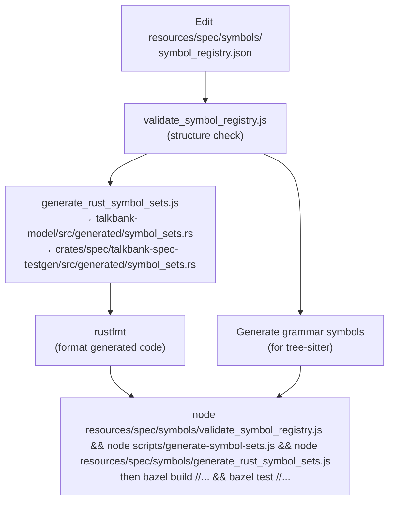

# Spec Workflow

**Status:** Current
**Last updated:** 2026-03-24 01:32 EDT

Specifications in `spec/` are the source of truth for CHAT format intent, grammar
examples, and validation/error contracts.

## Adding a Construct Spec

Construct specs define valid CHAT patterns with expected parse trees.

### 1. Create the Spec File

Create a new markdown file in the appropriate `resources/spec/constructs/` subdirectory:

```text
resources/spec/constructs/
├── header/         # Header-related constructs
├── main_tier/      # Main tier patterns
├── tiers/          # Dependent tier patterns
├── utterance/      # Utterance-level patterns
└── word/           # Word syntax patterns
```

### 2. Write the Spec

```markdown
# my_example

Description of what this example demonstrates.

## Input

\```utterance
*CHI:	hello world .
\```

## Expected CST

\```cst
(utterance
  (main_tier
    ...))
\```

## Metadata

- **Level**: utterance
- **Category**: main_tier
```

The code fence label (e.g., `utterance`, `mor_dependent_tier`) selects which
template wraps the input into a full CHAT file.

### 3. Generate the CST

Parse your input with tree-sitter to get the actual CST, then copy it as the Expected CST (stripping positions and field names).

### 4. Regenerate The Affected Generated Artifacts

```bash
just spec gen-tree-sitter-tests && just spec gen-rust-tests && just spec gen-error-docs
```

Use `just spec gen-tree-sitter-tests && just spec gen-rust-tests && just spec gen-error-docs` when you intentionally changed generated grammar corpus
tests, generated Rust tests, or generated error docs.

For isolated grammar additions, keep the change small:

1. Add or adjust one grammar example.
2. Add one full-file fixture if the change matters in context.
3. Regenerate only the artifacts that truly changed.

## Adding an Error Spec

Error specs define invalid CHAT patterns with expected error codes.

### 1. Create the Spec File

Error specs live in `resources/spec/errors/`, named by error code:

```text
resources/spec/errors/E301_missing_participants.md
```

### 2. Write the Spec

```markdown
# Error E301

## Metadata

- Code: E301
- Name: missing_participants
- Severity: Error
- Layer: parser

## Description

The @Participants header is required in every CHAT file.

## Examples

### missing_participants_basic

\```chat
@UTF8
@Begin
*CHI:	hello .
@End
\```
```

### Key Metadata Fields

- **Layer: parser** — the error is caught during `parser.parse_chat_file()` (file fails to parse)
- **Layer: validation** — the error is caught by `validate_with_alignment()` after successful parse
- **Status: not_implemented** — generates `#[ignore]` tests (validation logic not yet coded)

### 3. Regenerate The Affected Artifacts

```bash
just spec gen-tree-sitter-tests && just spec gen-rust-tests && just spec gen-error-docs
bazel build //... && bazel test //...
```

## Updating the Symbol Registry

The symbol registry at `resources/spec/symbols/symbol_registry.json` defines character sets used by the grammar and Rust crates.



After editing:

```bash
node resources/spec/symbols/validate_symbol_registry.js && node scripts/generate-symbol-sets.js && node resources/spec/symbols/generate_rust_symbol_sets.js    # Regenerate Rust and JS constants
just spec gen-tree-sitter-tests && just spec gen-rust-tests && just spec gen-error-docs       # If generated grammar/tests/docs depend on the symbols
```

## Common Mistakes

- **Editing generated files** — never edit `grammar/test/corpus/` or `crates/talkbank-parser-tests/tests/generated/` by hand
- **Running `just spec gen-tree-sitter-tests && just spec gen-rust-tests && just spec gen-error-docs` reflexively** — use it when generated artifacts changed, not as a substitute for thinking about what kind of test authority the change really needs
- **Wrong layer** — parser-layer specs expect parse failure; validation-layer specs expect parse success + error report
