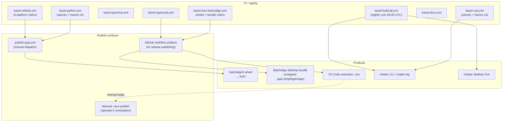

# Release Pipeline

**Last modified:** 2026-06-01 01:05 PDT

How a code change becomes a published artifact, **as the repo actually
ships today**. Several products emerge from this monorepo; only one
(`batchalign3` on PyPI) has automated publishing wired up. The rest are
either workflow-artifact-only or hand-published. This page is a map of
that reality, not a wishlist.

## Workflows that exist

Every CI workflow under `.github/workflows/` is Bazel-driven:

| Workflow file | Triggers | Purpose |
|---|---|---|
| `bazel-rust.yml` | push/PR on Rust paths | Build + test all Rust tiers (ubuntu + macos-14) |
| `bazel-python.yml` | push/PR on Python / batchalign-engine paths | Build cdylib + `py_test` + CLI smoke (ubuntu + macos-14) |
| `bazel-grammar.yml` | push/PR on `grammar/**`, symbols | Rust binding build + generated-artifact drift check |
| `bazel-typescript.yml` | push/PR on `apps/vscode-extension/**`, schemas | Build / test / package the VS Code extension (uploads `.vsix` artifact) |
| `bazel-docs.yml` | push/PR on `book/**` | `bazel run //book:html` + `//book:linkcheck`; uploads `book-html` |
| `bazel-tauri-batchalign.yml` | push/PR/dispatch on Batchalign GUI paths | PR-only smoke (ubuntu); on `main` + dispatch, matrix bundle of the Batchalign desktop app (macOS arm64, macOS x86_64, Linux x86_64) |
| `bazel-wheels.yml` | push/PR on wheel-affecting paths | Multi-platform wheel build + abi3 smoke (4-cell matrix); artifact-only |
| `bazel-build-all.yml` | nightly cron + dispatch | Exhaustive `bazel build //...` + `bazel test //...` on ubuntu-latest and macos-14 |
| `publish-pypi.yml` | `workflow_dispatch` only | Build wheels via Bazel + maturin and upload to PyPI via OIDC trusted publisher |

Everything else (chatter binary release, VS Code Marketplace push,
desktop bundle distribution, code signing) is **not automated yet**.
Where contributors and operators need to ship those today, the process
is manual; the gaps are listed at the bottom of this page.

## Products and how each ships today



Verified against `.github/workflows/` on 2026-06-01.

### 1. `batchalign3` Python wheel → PyPI

**Build path in CI:** `bazel-python.yml` runs on every PR touching
Python / batchalign-engine. It builds the cdylib (`_core_so`), runs
`py_test`, and does a `py_binary --help` smoke. `bazel-wheels.yml`
additionally builds the wheel on a 4-cell matrix (macos-14, macos-13,
ubuntu-latest, ubuntu-24.04-arm) and smoke-installs it under Python
3.10 and 3.12 to prove the `cp310-abi3` tag works.

**Publish path:** `publish-pypi.yml` is the only publish workflow in
the repo and is `workflow_dispatch` only.

1. Operator dispatches with inputs `tag` (must match
   `python/pyproject.toml [project].version`) and `publish` (boolean).
2. `verify-version` job asserts the version string matches.
3. `build` matrix (macOS arm64, macOS x86_64, Linux x86_64, Linux
   aarch64, Windows x86_64) runs `bazel run -c opt //python/batchalign:wheel`
   on each runner and uploads `.whl` artifacts. The wheel is built via
   maturin (sole reader of `pyproject.toml` for the platform-tagging
   matrix); the day-to-day Bazel `py_library` path uses `pyo3` directly,
   not maturin.
4. If `publish=true`, the `publish` job downloads all artifacts and
   runs `pypa/gh-action-pypi-publish` with `id-token: write` (OIDC
   trusted publisher; no API token in the repo).

**Local wheel build:** `bazel run -c opt //python/batchalign:wheel`
lands the wheel in `python/target/wheels/`.

### 2. Batchalign desktop GUI → workflow artifacts (unsigned)

**Build path in CI:** `bazel-tauri-batchalign.yml`. Two jobs:

- `smoke` runs on every PR (ubuntu-latest): builds the frontend
  filegroup and generated protocol artifacts.
- `bundle` runs on pushes to `main` and on `workflow_dispatch` only.
  Matrix:
  - `macos-14` → `aarch64-apple-darwin`
  - `macos-13` → `x86_64-apple-darwin`
  - `ubuntu-latest` → `x86_64-unknown-linux-gnu`

  Each cell builds the sidecar (`bazel build
  //python/batchalign:sidecar`) then runs `bazel run
  //apps/batchalign/batchalign-gui/src-tauri:bundle -- --target <triple>`.
  Bundles upload as workflow artifacts (`batchalign-<target>`),
  retention 14 days.

**Windows is not built.** The bundle matrix has a `windows-latest` row
commented out: `tools/bazel` is a bash wrapper that bazelisk rejects on
PowerShell hosts. Re-enabling requires a portable wrapper.

**Publishing:** there is no GitHub Release publishing step. To get a
bundle to a tester, an operator downloads the workflow artifact and
hands it over directly.

**Signing:** bundles are unsigned. See
[code-signing-and-distribution.md](./code-signing-and-distribution.md).

### 3. VS Code extension → manual marketplace publish

**Build path in CI:** `bazel-typescript.yml` runs on every PR touching
`apps/vscode-extension/**` or `schemas/**`. It runs `bazel run
//apps/vscode-extension:build`, `:test`, and `:package` on ubuntu-latest
and uploads the resulting `.vsix` as a workflow artifact
(`vscode-extension-vsix`).

**Publishing is manual today.** There is no `publish-vscode.yml` or
equivalent in the repo. To publish a release:

1. Bump `apps/vscode-extension/package.json` version on `main`.
2. On a maintainer workstation, `just vscode build && just vscode package`
   (or download the `vscode-extension-vsix` artifact from the matching
   CI run).
3. `npx vsce publish --packagePath <vsix>` using a marketplace PAT held
   by the operator.

An automated release workflow (cross-platform `.vsix` matrix with
bundled `chatter-lsp`, GitHub Release upload, optional marketplace
push) is a planned follow-up. See
[`vscode/developer/releasing.md`](../vscode/developer/releasing.md) for
the current step-by-step.

### 4. `chatter` CLI + `chatter-lsp` → no release workflow

`bazel-rust.yml` builds and tests these on every PR
(`//crates/chatter/...`). `bazel-build-all.yml` re-builds them
exhaustively each night. **There is no workflow that publishes binaries
to a GitHub Release.** Users today install from source:

```bash
bazel build //crates/chatter/chatter-cli:chatter
# or
cargo install --path crates/chatter/chatter-cli
```

A `chatter` binary release workflow is a follow-up.

### 5. Chatter desktop GUI → nightly only

`apps/chatter/chatter-gui` has **no dedicated CI workflow**. The only
coverage today is the nightly `bazel-build-all.yml`, which builds and
tests everything but does not produce or upload a Tauri bundle.

A dedicated `bazel-tauri-chatter.yml` modelled on the Batchalign one is
a follow-up.

### 6. mdBook documentation

`bazel-docs.yml` builds the book and runs the link checker on every PR
touching `book/**` or `bazel/book/**`, and uploads the HTML as a
`book-html` artifact. There is no GitHub Pages deploy step yet;
adding one is a one-line change (e.g.
`peaceiris/actions-gh-pages` consuming the artifact).

## Triggers, in one table

| Workflow | Push to main | PR | Cron | Dispatch |
|---|---|---|---|---|
| `bazel-rust.yml` | yes (Rust paths) | yes (Rust paths) | — | — |
| `bazel-python.yml` | yes (Py / engine paths) | yes | — | — |
| `bazel-grammar.yml` | yes (grammar paths) | yes | — | — |
| `bazel-typescript.yml` | yes | yes | — | — |
| `bazel-tauri-batchalign.yml` | yes (smoke + bundle) | yes (smoke only) | — | yes (bundle) |
| `bazel-wheels.yml` | yes | yes | — | — |
| `bazel-docs.yml` | yes | yes | — | — |
| `bazel-build-all.yml` | — | — | `0 6 * * *` | yes |
| `publish-pypi.yml` | — | — | — | yes |

Publishing always requires a deliberate human gesture
(`workflow_dispatch`). Everything else is automatic on push/PR.

## Versioning

`just versions` is the source of truth. Current values:

| Surface | Source field | Today's value |
|---|---|---|
| Python wheel `batchalign3` | `python/pyproject.toml [project].version` | `0.3.0` |
| Rust workspace (chatter, talkbank-*, clan-*) | `[workspace.package].version` in root `Cargo.toml` | `0.2.0` |
| `batchalign-engine` Rust crate | per-crate `[package].version` | `0.3.0` |
| Chatter GUI bundle | `apps/chatter/chatter-gui/src-tauri/tauri.conf.json` | `0.1.0` |
| VS Code extension | `apps/vscode-extension/package.json` version | bump per Marketplace push |

Pinned toolchain (from `just versions`): Python 3.12, uv 0.5.18,
maturin 1.7.4, Rust 1.95.0, pyapp 0.27.0.

The Rust workspace and the Python preview line are on **separate
release trains** by design.

## Local pre-merge gate

`bazel build //... && bazel test //...` is the canonical pre-merge
gate. The pre-push hook (`scripts/pre-push.sh`, installed via
`ln -sf ../../scripts/pre-push.sh .git/hooks/pre-push`) runs the fast
subset locally. See [Quality Gates](../contributing/quality-gates.md).

## Known gaps (follow-up work)

- No `chatter` / `chatter-lsp` GitHub Release workflow.
- No automated VS Code extension release; manual `vsce publish` today.
- No GitHub Release upload for Batchalign desktop bundles (artifacts
  only). No Windows bundle.
- No Chatter desktop GUI CI workflow beyond the nightly.
- No code signing or notarization on any platform; see
  [code-signing-and-distribution.md](./code-signing-and-distribution.md).
- No GitHub Pages deploy for the book.
- `//python:requirements_test` (lockfile drift) is `manual`-tagged
  and not enforced in CI; see the comment in `bazel-python.yml`.

## See also

- [Code Signing and Distribution](./code-signing-and-distribution.md)
- [CI and Release](../contributing/ci-and-release.md)
- [Quality Gates](../contributing/quality-gates.md)
- [Branch Protection](../contributing/branch-protection.md)
- [Versioning](./versioning.md)
- [Release Contract](./release-contract.md)
