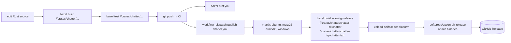
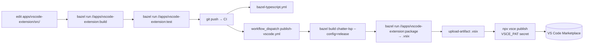

# Release Pipeline

**Last modified:** 2026-05-15 20:24 IST

How a code change becomes a published artifact. Five surfaces ship from
this monorepo, each with its own chain:

| Surface | Artifact | Distribution channel | Workflow |
|---|---|---|---|
| `batchalign3` Python wheel | `.whl` (Linux x86_64 + arm64, macOS x86_64 + arm64) | PyPI | `publish-pypi.yml` |
| `chatter` + `chatter-lsp` binaries | static Rust binaries, all 4 desktop OSes | GitHub Releases | `publish-chatter.yml` |
| VS Code extension | `.vsix` | VS Code Marketplace | `publish-vscode.yml` |
| Desktop apps (chatter-gui, batchalign-gui-dashboard) | `.app`/`.dmg`/`.msi`/AppImage | GitHub Releases | `publish-desktop.yml` |
| mdBook documentation | static HTML site | GitHub Pages (or wherever you wire it) | `bazel-docs.yml` |

Each chain is fully described below — what each step does, what env
vars or secrets it consumes, what the failure modes are, and how to
recover.

---

## The contract

Every release artifact is built by **Bazel** (which calls the
ecosystem-native tool — maturin, cargo, vite, vsce, cargo tauri, mdbook).
Every release artifact is **published** by a workflow that:

1. Runs Bazel for the build half (hermetic, cached, identical to local dev).
2. Calls the publish API directly for the push half (PyPI, Marketplace,
   GitHub Releases) using secrets from the appropriate environment.

Publish APIs cannot be Bazelized:

- **PyPI** wants twine + OIDC trusted-publisher tokens.
- **VS Code Marketplace** wants `vsce` + a Personal Access Token.
- **GitHub Releases** wants `gh` or `softprops/action-gh-release` +
  `${{ secrets.GITHUB_TOKEN }}`.
- **Code signing** (macOS notarization, Windows Authenticode) needs
  signing certificates protected at the workflow level.

So every chain is: `bazel build` (deterministic, cached) → `publish API
call` (workflow-only, secret-bearing).

---

## 1. `batchalign3` Python wheel → PyPI

```mermaid
flowchart LR
    A[edit python/ or batchalign-pyo3/]
    A --> B[bazel run //python/batchalign:develop\n→ maturin develop]
    B --> C[bazel run //python/batchalign:test\n+ //python/batchalign:lint]
    C --> D[git push → CI]
    D --> E[bazel-python.yml\nfast PR check]
    D --> F[workflow_dispatch publish-pypi.yml]
    F --> G[bazel run //python/batchalign:wheel\non Linux, macOS x86, macOS arm64]
    G --> H[upload-artifact .whl per platform]
    H --> I[pypa/gh-action-pypi-publish\n(OIDC trusted-publisher)]
    I --> J[(PyPI)]
```

**Local iteration:**

```bash
bazel run //python/batchalign:develop    # editable install — rebuilds the PyO3 .so
bazel run //python/batchalign:test       # pytest
bazel run //python/batchalign:lint       # mypy
```

**Building a release wheel locally:**

```bash
bazel run //python/batchalign:wheel
ls python/target/wheels/            # batchalign3-0.1.0-py3-cp312-<plat>.whl
```

The wheel is built by `maturin build --release --manifest-path
crates/batchalign/batchalign-pyo3/Cargo.toml --out python/target/wheels`.
The build script is `build/python/maturin_build.sh`, invoked by Bazel
with `uv` passed as `$1` from `@multitool//tools/uv`.

**Publishing to PyPI (`publish-pypi.yml`):**

1. **Inputs:** `tag` (wheel version, e.g. `0.1.5`), `publish` (boolean
   — set false for a dry-run that only uploads artifacts).
2. **Build matrix:** runs `bazel run //python/batchalign:wheel` on
   `ubuntu-latest`, `macos-13`, `macos-14` in parallel. Each produces
   a platform-tagged wheel.
3. **Artifact upload:** each wheel becomes a workflow artifact
   (`batchalign3-wheel-<os>`).
4. **Publish job:** only runs when `publish=true`. Downloads all
   wheels into `dist/`, then `pypa/gh-action-pypi-publish` uploads via
   PyPI's OIDC trusted-publisher (no API token; identity is proven via
   GitHub OIDC).

**Trusted-publisher setup (one-time on PyPI):** configure the project
at <https://pypi.org/manage/project/batchalign3/settings/publishing/>
with `TalkBank/talkbank-tools` as the publisher and `publish-pypi.yml`
as the workflow filename.

**Failure modes:**

- **Maturin build fails locally:** check `uv` is installed (Bazel
  fetches a hermetic copy via multitool, but `python/uv.lock` must
  also be in sync — run `cd python && uv lock` if pyproject.toml
  changed).
- **CI build passes on x86 but fails on arm64:** likely a torch /
  pyannote.audio install issue; check the macos-14 logs.
- **PyPI upload fails with "already exists":** PyPI is immutable;
  bump the version in `python/pyproject.toml` and re-run.
- **OIDC token mismatch:** the workflow file path or repo name in
  PyPI's trusted-publisher config drifted; reset on the PyPI side.

---

## 2. `chatter` + `chatter-lsp` binaries → GitHub Releases



**Local iteration:**

```bash
bazel run //crates/chatter/chatter-cli:chatter -- validate path/to/file.cha
bazel run //crates/chatter/chatter-lsp:chatter-lsp  # blocks; speaks LSP over stdio
```

**Local release binary:**

```bash
bazel build --config=release //crates/chatter/chatter-cli:chatter
ls bazel-bin/crates/chatter/chatter-cli/chatter      # the binary
```

**Publishing a release (`publish-chatter.yml`):**

1. Trigger via Actions → `publish · chatter (cli + lsp binaries)` →
   Run workflow. Provide `tag` (e.g. `v0.2.1`) and `draft` flag.
2. Build matrix: 4 runners (Linux x86_64, macOS arm64, macOS x86_64,
   Windows x86_64). Each invokes `bazel build --config=release`.
3. Each runner stages `chatter` + `chatter-lsp` into `out/`, uploads
   as a platform-tagged artifact.
4. Release job downloads all artifacts and attaches them to a new
   GitHub Release (draft by default).

**Code signing:** the publish workflow does NOT sign the chatter
binaries — they're statically-linked Rust binaries that GitHub releases
as-is. Users on macOS may need to run them under `xattr -d
com.apple.quarantine /path/to/chatter` the first time. If signed
binaries are needed in the future, wire codesigning into this workflow
between the build and the artifact upload.

---

## 3. VS Code extension → Marketplace



**Local iteration:**

```bash
bazel run //apps/vscode-extension:build       # compile TypeScript
bazel run //apps/vscode-extension:test        # run tests
bazel run //apps/vscode-extension:package     # produces .vsix in cwd
```

The extension launches `chatter-lsp` over stdio. For local
development, `chatter-lsp` must be in your `PATH` or built via
`bazel build //crates/chatter/chatter-lsp:chatter-lsp` (the extension
looks under `target/debug/` and `target/release/` as fallback).

**Publishing (`publish-vscode.yml`):**

1. Trigger via Actions. Provide `version` (e.g. `0.5.0`) and
   `publish` flag.
2. Build `chatter-lsp` in release mode (bundled into the .vsix as
   the LSP binary that ships with the extension).
3. Build + package the extension via Bazel → produces `.vsix`.
4. Upload `.vsix` as an artifact.
5. If `publish=true`, run `npx vsce publish --packagePath <.vsix>`
   using the `VSCE_PAT` secret (a Personal Access Token from
   <https://dev.azure.com/>).

**PAT setup (one-time):** create at <https://dev.azure.com/_usersSettings/tokens>
with "Marketplace > Manage" scope; store in the
`vscode-marketplace` GitHub environment as secret `VSCE_PAT`.

---

## 4. Desktop apps (Tauri) → GitHub Releases

```mermaid
flowchart LR
    A[edit apps/<chatter|batchalign>/...]
    A --> B[bazel build src-tauri Rust]
    B --> C[bazel run dashboard:build\n(if batchalign-gui-dashboard)]
    C --> D[git push → CI]
    D --> E[bazel-typescript.yml\n+ bazel-rust.yml]
    D --> F[workflow_dispatch publish-desktop.yml]
    F --> G[matrix: macOS arm/x86, win, linux]
    G --> H[cargo tauri build\nwith Apple/Win signing secrets]
    H --> I[upload bundles\n.app/.dmg/.msi/AppImage]
    I --> J[(GitHub Release)]
```

**Local iteration:**

```bash
cd apps/chatter/chatter-gui && cargo tauri dev          # hot reload
cd apps/batchalign/batchalign-gui-dashboard && cargo tauri dev
```

**Local bundle (unsigned):**

```bash
cd apps/chatter/chatter-gui && cargo tauri build
# Output: src-tauri/target/release/bundle/<platform>/
```

**Publishing (`publish-desktop.yml`):**

1. Trigger via Actions. Choose which app to bundle (`chatter-gui`,
   `batchalign-gui-dashboard`, or both).
2. Build matrix: 4 runners. For `batchalign-gui-dashboard`, the React
   dashboard SPA is built first (`bazel build //apps/batchalign/batchalign-cli-webdashboard:dist`)
   so Tauri can embed it. The `:dist` label is the hermetic Vite
   TreeArtifact emitted by `vite_bin.vite` — no host `npm install`.
3. `cargo tauri build` runs with Apple Developer ID + notarytool
   secrets present (on macOS) and Windows code-signing creds (on
   Windows). Linux bundles are unsigned.
4. Bundles upload as workflow artifacts.

**Apple signing setup:** secrets needed in the workflow environment:
`APPLE_CERTIFICATE`, `APPLE_CERTIFICATE_PASSWORD`,
`APPLE_SIGNING_IDENTITY`, `APPLE_API_KEY`, `APPLE_API_ISSUER`. See
`book/src/operations/code-signing-and-distribution.md` for the certificate
provisioning workflow.

---

## 5. mdBook → GitHub Pages

```mermaid
flowchart LR
    A[edit book/src/]
    A --> B[bazel run //book:serve\n(local preview)]
    B --> C[git push → CI]
    C --> D[bazel-docs.yml]
    D --> E[bazel run //book:html]
    E --> F[bazel run //book:linkcheck]
    F --> G[upload-artifact book-html]
    G --> H{deploy?}
    H -->|wire when ready| I[(GitHub Pages)]
```

**Local iteration:**

```bash
bazel run //book:serve         # auto-reload at localhost:3000
```

**Build for inspection:**

```bash
bazel run //book:html          # output: book/build/html/
```

The current `bazel-docs.yml` builds the book and uploads the HTML as
an artifact on every push to `main`. Deploying to GitHub Pages is a
one-line addition (drop `peaceiris/actions-gh-pages` onto the artifact)
when you want a public docs site live.

---

## Trigger summary

| Workflow | Triggers |
|---|---|
| `bazel-rust.yml` | every push/PR touching Rust |
| `bazel-python.yml` | every push/PR touching Python or PyO3 |
| `bazel-typescript.yml` | every push/PR touching apps/vscode-extension/ or apps/batchalign/batchalign-cli-webdashboard/ |
| `bazel-grammar.yml` | every push/PR touching grammar/ or symbols |
| `bazel-docs.yml` | every push/PR touching book/ |
| `bazel-build-all.yml` | nightly cron (06:00 UTC) + manual |
| `publish-pypi.yml` | manual only |
| `publish-chatter.yml` | manual only |
| `publish-vscode.yml` | manual only |
| `publish-desktop.yml` | manual only |

Publishing always requires a deliberate human gesture (workflow
dispatch). Build/test gates run automatically.

---

## Cross-cutting workflows

### Repinning the crate_universe lockfile

Required after any `Cargo.toml` edit that touches a dependency.

```bash
bazel run //bazel/cargo:repin
git diff MODULE.bazel.lock     # inspect what changed
git add MODULE.bazel.lock && git commit -m "deps: repin crate_universe"
```

If you forget, the CI Rust workflow will fail with a `crate_universe`
mismatch error. The fix is the same as above.

### Refreshing the sqlx query cache

Required after any `sqlx::query!` macro edit in batchalign.

```bash
bazel run //bazel/sqlx:prepare
git diff crates/batchalign/batchalign-cli/.sqlx/
git add crates/batchalign/batchalign-cli/.sqlx && git commit -m "sqlx: prepare"
```

Without an up-to-date `.sqlx/`, `bazel build //crates/batchalign/...`
will fail at the sqlx compile-time validation step.

### Regenerating tree-sitter parser.c

Required after any `grammar/grammar.js` edit.

```bash
bazel run //grammar:tree_sitter_generate
git diff grammar/src/parser.c grammar/src/grammar.json grammar/src/node-types.json
git add grammar/src/ && git commit -m "grammar: regenerate"
```

The `bazel-grammar.yml` CI workflow asserts no drift between
`grammar.js` and `src/parser.c`.

---

## Versioning

| Surface | Version source | Bump strategy |
|---|---|---|
| Rust workspace crates (`talkbank-*`, `chatter-*`, `clan-*`) | `[workspace.package] version` in root `Cargo.toml` | semver; bump on a behavior change |
| `batchalign-cli`, `batchalign-pyo3`, `batchalign-types` | per-crate `[package] version` (0.1.x preview line) | independent of the workspace version |
| Python wheel `batchalign3` | `[project] version` in `python/pyproject.toml` | semver; pre-release tags allowed |
| VS Code extension | `version` in `apps/vscode-extension/package.json` | bump on every Marketplace upload |
| chatter binaries | `[workspace.package] version` | same as Rust workspace |

The Rust workspace and the Python preview line are intentionally on
**separate release trains** — see the comment in `Cargo.toml`'s
`[workspace.dependencies]` for the rationale.

---

## Quick command reference

```bash
# Local dev
bazel run //python/batchalign:develop            # editable batchalign3
bazel run //crates/chatter/chatter-cli:chatter   # chatter CLI
bazel run //book:serve                           # book preview

# Release artifacts (local)
bazel run //python/batchalign:wheel              # batchalign3 wheel
bazel build --config=release \
  //crates/chatter/chatter-cli:chatter \
  //crates/chatter/chatter-lsp:chatter-lsp       # release Rust binaries
bazel run //apps/vscode-extension:package        # .vsix
cd apps/chatter/chatter-gui && cargo tauri build # unsigned Tauri bundle

# Lockfile / cache maintenance
bazel run //bazel/cargo:repin                    # after Cargo.toml edit
bazel run //bazel/sqlx:prepare                   # after sqlx::query! edit
bazel run //grammar:tree_sitter_generate         # after grammar.js edit
```

---

## See also

- `.github/workflows/` — every CI workflow, well-commented
- `CONTRIBUTING.md` — quick-start + `bazel run` reference for every binary
- `book/src/operations/code-signing-and-distribution.md` — macOS/Windows
  signing setup details
- `book/src/operations/release-contract.md` — what we promise users
  about breaking changes
- `book/src/operations/versioning.md` — semver policy in detail
